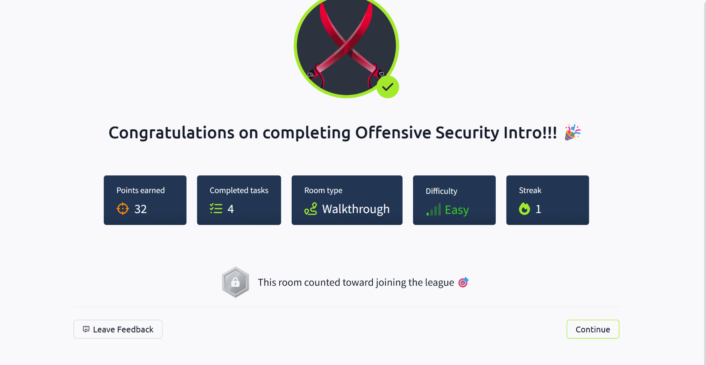

# TryHackMe – Offensive Security Intro 🔐

**Status**: ✅ Completed  
**Date**: July 1, 2025  
**Points Earned**: 32  
**Room Type**: Walkthrough  
**Difficulty**: Easy  
**Streak**: 1 day

---

## 🧠 What I Learned
- Fundamentals of offensive (ethical) hacking
- Key difference between red teaming and black-hat activity
- How cybersecurity labs are safely designed for real-world practice
- How to follow guided walkthroughs in TryHackMe

---

## 🧩 Personal Takeaways
- I now understand what “offensive” means in cybersecurity
- I completed 4 tasks and maintained my streak
- This room boosted my confidence to take on more technical labs

---

## 📷 Completion Screenshot

